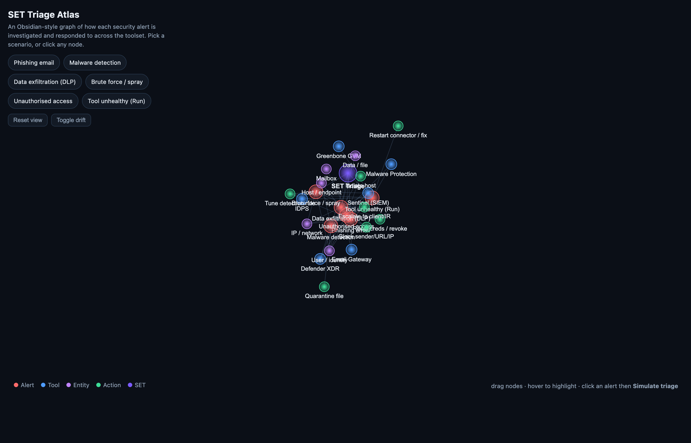

# SET Triage Atlas

**▶ Live demo: https://mechmukul.github.io/set-triage-atlas/** (runs in your browser, no install)

An interactive, **Obsidian-style knowledge graph** of how a Security Engineering Team investigates
and responds to different security alerts.



## Try it live (30 seconds)
1. Open the live demo link above.
2. Click a scenario chip (**Phishing**, **Malware**, **Data exfiltration (DLP)**, **Brute force**, **Unauthorised access**, **Tool unhealthy**) — the graph focuses that alert's tools, entities, and actions.
3. In the panel, click **Simulate triage** — it pulses along the graph and steps through the playbook: Detect &rarr; Triage &rarr; Investigate &rarr; Contain &rarr; Recover &rarr; Close.
4. Drag nodes, hover to highlight, or click any node to explore.

## What it shows
- A force-directed graph linking **alerts &rarr; tools &rarr; entities &rarr; response actions**.
- Six common alert types, each with a step-by-step playbook naming the tool and, where useful, the KQL to run.
- Node types: alert (red), tool (blue), entity (purple), action (green), the SET hub (violet).

## Why it matters
Good triage is a repeatable path, not guesswork: from the alert, to the right tool, to the entity at
risk, to a proportionate action, then closing the loop by tuning and assigning ownership. This makes
that thinking visible.

## Run locally
```bash
python3 -m http.server 8000   # then visit http://localhost:8000
```
Or just open `index.html`.

## Notes
Illustrative playbooks, no client data. Companion to **set-watchtower** (tooling health) and
**gvm-triage** (vulnerability prioritisation).
